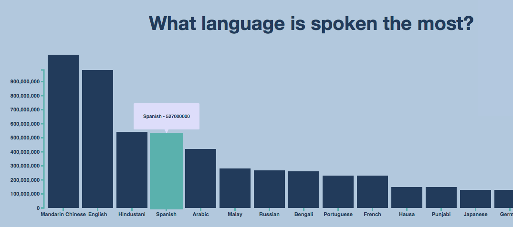

# Assessment 1
Datavisualisation

## Background
I have made a data visualisation with d3 for the first assessment of the Frontend 3 course. For the base of my code I used a simple bar chart that I found. I thought that this base was a bit too simple and decided to add some things to it. I wanted to add some transitions,  not using CSS but with DOM manipulation through d3. 

I spent a lot of time searching and trying out transitions without much luck. This was because these transitions used a lot of HTML or were just too complicated for me to understand. Luckily I found someone who had used the exact same base chart as I had. Now I could use this transition for myself and actually understand what is happening in the code. I also found another person with the same base code who had added a tooltip that I was also looking to use.

Now all that was left for me to do was combine these codes and make sure that I understood how most of it works. I think that I am pretty well versed in HTML and CSS. Java is still a bit challenging for me, so I am really proud of the end result. As simple as it may be.

## Data
Data was transferred from a TSV file which included the most spoken languages, and how many speakers they have. Visualised with a simple bar chart.

## Features
Redrawing and animated transitions

 *    - parse tab-separated values
 *    - number formatting
 *    - position encodings
 *    - data processing
 *    - axes
 *    - tooltip

## License

Released under the 
